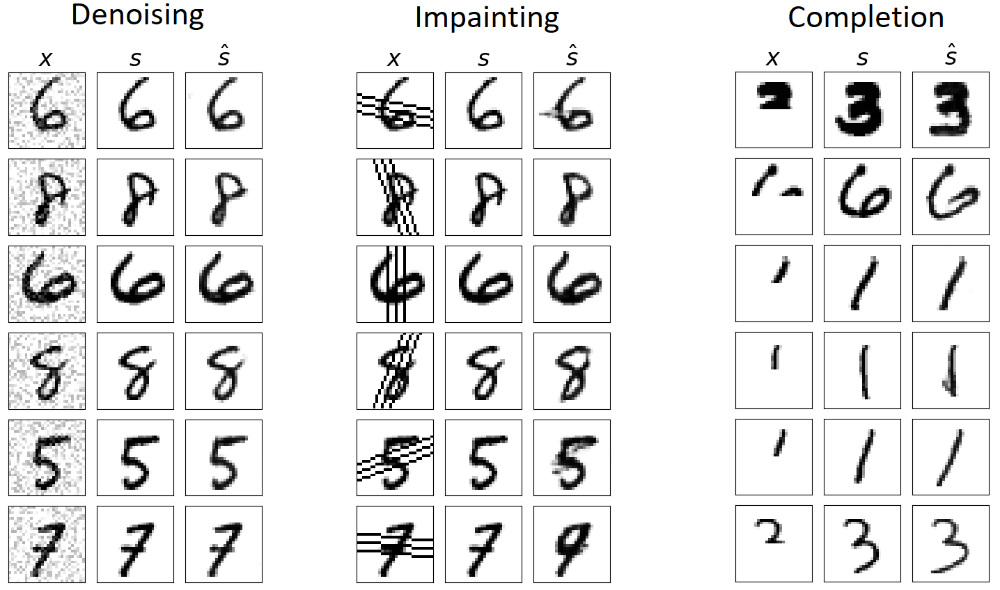
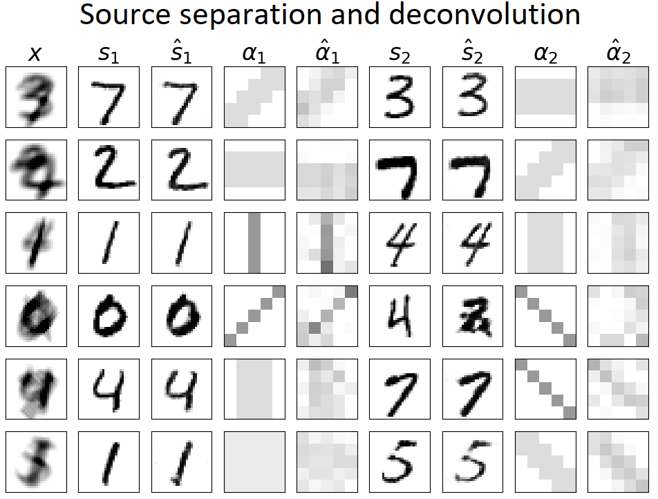

# Single-Channel Signal Separation and Deconvolution with Generative Adversarial Networks

This codebase is the implementation of the paper Single-Channel Signal Separation and Deconvolution with Generative Adversarial Networks (accepted by IJCAI 2019). The paper proposes a synthesizing-decomposition (S-D) approach to solve source separation and deconvolution problem. In synthesizing, a DCGAN is proposed for generating clean sources. In decomposition, the sources and filters are optimized to minimize the reconstruction loss. For more details see the paper here: (To appear)

## Environments

Python 3.7

Pytorch 1.0

## Run the code

First, set your workspace. 

```
WORKSPACE='/vol/vssp/msos/qk/workspaces/gan_source_separation'
```
Second, train DCGAN model. 

```
CUDA_VISIBLE_DEVICES=0 python pytorch/main.py train --workspace=$WORKSPACE --cuda
```

Third, do denoising, impainting, completition

```
TASK='denoise'    # 'denoise' | 'impaint' | 'complete'
CUDA_VISIBLE_DEVICES=0 python pytorch/denoise_impaint_complete.py --workspace=$WORKSPACE --task=$TASK --repeats_num=8 --cuda
```

Fourth, do source separation and deconvolution

```
CUDA_VISIBLE_DEVICES=0 python pytorch/deconvolve_separate.py --workspace=$WORKSPACE --task=deconvolve_separate --repeats_num=8 --cuda
```

## Results
Denoising, impainting and completion results. Symbol x is input mixture. Symbol s is ground truth source. Symbol \hat{s} is estimated source. 



Separation and deconvolution results. Symbol x is input mixture. Symbol s and a are ground truth sources and filters. Symbol \hat{s} and \hat{a} are estimated sources and filters. 



## Citation

To appear. 